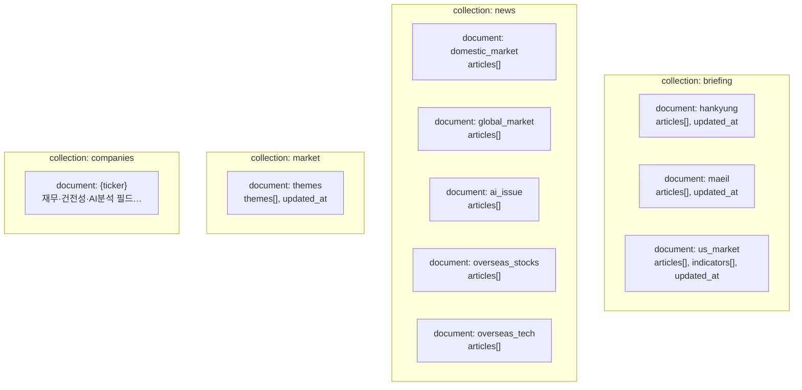
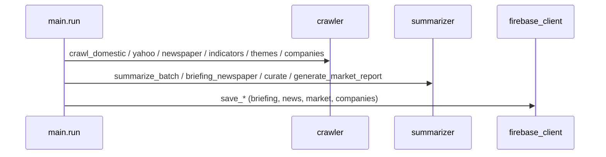

# Sapiens — 개발 스택·구조 스펙 (`sped.md`)

> 저장소: **Sapiens** — 한국 투자자용 뉴스·브리핑 Android 앱 + Python 데이터 파이프라인  
> 문서 목적: 화면·파일 구조·Firestore·파이프라인·외부 연동을 한곳에 정리  
> 최종 반영: 2026-04-19 (코드베이스 기준)

---

## 1. 프로젝트 한눈에

| 구분 | 설명 |
|------|------|
| **클라이언트** | Kotlin + Jetpack Compose, Material 3, MVVM(Repository + ViewModel) |
| **백엔드(운영 데이터)** | Google **Firestore** (named DB: `sapiens`) |
| **배치 파이프라인** | Python 3 — `pipeline/` 크롤링 → Anthropic **Claude** 요약 → Firestore 쓰기 |
| **레포** | Git (로컬 워크스페이스 `d:\project\Sapiens`). CI용 `.github/workflows`는 현재 저장소에 없음 |

---

## 2. 기술 스택

### 2.1 Android (`app/`)

| 영역 | 기술 | 비고 |
|------|------|------|
| 언어 | Kotlin 2.x (`gradle/libs.versions.toml`) | `compileSdk` 36, `minSdk` 26 |
| UI | Jetpack Compose + Material 3 (strictly 1.3.1 in `build.gradle.kts`) | `compose-bom` 2026.02.01 |
| 아키텍처 | ViewModel + StateFlow/Flow, `viewModel(factory = …)` | `BriefingViewModel`, `NewsViewModel` |
| 비동기 | Kotlin Coroutines, `callbackFlow` + Firestore snapshot | `NewsRepositoryImpl` |
| 이미지 | Coil Compose 2.7.0 | |
| 로컬 설정 | Datastore Preferences | `UserPreferencesRepository` |
| Firebase | BOM 33.1.0 (모듈 `build.gradle.kts`), Firestore KTX, Auth KTX | `google-services.json` |
| 인증 | Firebase Auth + Google Sign-In (`play-services-auth`) | `AuthRepository.kt` |

### 2.2 Python 파이프라인 (`pipeline/`)

| 패키지 | 용도 |
|--------|------|
| `requests`, `beautifulsoup4`, `lxml` | HTML/HTTP 크롤링 |
| `anthropic` | 기사·시황·기업 분석 요약 |
| `firebase-admin` | Firestore 서버 쓰기 |
| `python-dotenv` | `.env` 로드 |
| `pytz` | 시간대(신문 API 등) |
| `playwright` | 토스 등 경로에서 선택적 사용 |

### 2.3 외부 서비스·API

| 서비스 | 용도 |
|--------|------|
| **Firestore** | 앱이 구독하는 문서에 파이프라인이 `merge` 저장 |
| **Anthropic Claude** | `ANTHROPIC_API_KEY` — `summarizer.py` |
| **네이버** | 금융 뉴스 HTML, 미디어 신문 API, 증권 테마 API(`stock.naver.com`) |
| **Yahoo Finance** | 해외 뉴스 HTML 스트림(스톡/테크) |

---

## 3. 저장소 디렉터리 구조 (요약)

```
Sapiens/
├── app/                              # Android 앱 모듈
│   ├── build.gradle.kts
│   ├── google-services.json          # Firebase Android 앱 설정 (민감정보 주의)
│   └── src/main/java/com/sapiens/app/
│       ├── MainActivity.kt
│       ├── data/
│       │   ├── auth/AuthRepository.kt
│       │   ├── mock/MockData.kt
│       │   ├── model/                # Article, Company, Market*, USReport …
│       │   ├── repository/
│       │   │   ├── NewsRepository.kt
│       │   │   ├── NewsRepositoryImpl.kt
│       │   │   └── FirestoreMappers.kt
│       │   └── store/UserPreferencesRepository.kt
│       └── ui/
│           ├── main/MainScreen.kt    # 하단 탭 4개 — 브리핑/뉴스/기업/마이
│           ├── briefing/             # BriefingScreen, BriefingViewModel, BriefingComponents
│           ├── news/                 # NewsScreen, NewsViewModel, NewsComponents
│           ├── company/                # CompanyScreen, CompanySearchBottomSheet
│           ├── my/MyScreen.kt
│           ├── common/                 # ArticleBottomSheet, CompanyBottomSheet, ChipColors
│           └── theme/                  # Color, Theme, Typography, Type, Dimens
├── pipeline/
│   ├── main.py                       # 엔트리: 크롤 → 요약 → Firestore
│   ├── crawler.py                    # 네이버·야후·신문·테마·지표·기업 번들
│   ├── summarizer.py                 # Claude 프롬프트 + merge_to_firestore_article
│   ├── firebase_client.py            # Firestore 쓰기 헬퍼
│   ├── company_crawler.py
│   ├── requirements.txt
│   └── .env                          # 로컬/CI 비밀키 (커밋 제외 권장)
├── gradle/libs.versions.toml
├── settings.gradle.kts
├── build.gradle.kts
└── sped.md                           # 본 문서
```

**참고:** `MarketRadarScreen.kt` 같은 화면은 **존재하지 않음**. 마켓 테마 데이터는 파이프라인이 `market/themes`에 저장하며, 앱 UI에서 별도 화면이 연결돼 있지 않을 수 있음.

---

## 4. 화면(Compose) 및 내비게이션

### 4.1 `MainScreen.kt` — 하단 탭

| 인덱스 | 탭 라벨 | Composable / 기능 |
|--------|---------|-------------------|
| 0 | 브리핑 | `BriefingScreen` + `BriefingViewModel` |
| 1 | 뉴스 | `NewsScreen` + `NewsViewModel` (국내/해외 토글 `NewsRegionToggle`) |
| 2 | 기업정보 | `CompanyScreen`, 검색 시트 `CompanySearchBottomSheet` |
| 3 | 마이 | `MyScreen` (테마 전환 등) |

- 상단 AppBar: 기업 탭에서 검색 아이콘 → `CompanySearchBottomSheet`
- 공통: `ArticleBottomSheet` 등으로 기사 상세

### 4.2 주요 Kotlin 파일 역할

| 파일 | 역할 |
|------|------|
| `BriefingScreen.kt` | 아침 브리핑 UI (한경/매경 신문, 미국 시황 카드 등) |
| `BriefingViewModel.kt` | 브리핑용 Flow 수집 |
| `NewsScreen.kt` | 국내/해외 뉴스 피드 UI |
| `NewsViewModel.kt` | `NewsFeedType`별 Firestore 구독 |
| `CompanyScreen.kt` | 기업 상세·검색 연동 |
| `NewsRepositoryImpl.kt` | Firestore 경로 상수 + 스냅샷 → 모델 매핑 |

---

## 5. 데이터 모델 (앱)

### 5.1 `Article` (`data/model/Article.kt`)

파이프라인 `merge_to_firestore_article` 출력과 정렬되는 필드:

- `source`, `headline`, `headline_ko`, `headline_en`, `summary`, `time`, `category`, `summaryPoints`, `tag`, `sourceColor`, `imageUrl`  
- 앱 모델은 `summaryPoints`(camelCase), Firestore 매퍼에서 스키마 맞춤 (`FirestoreMappers.kt`)

### 5.2 기타 모델

- `MarketIndicator`, `MarketIndex`, `MarketIndexSnapshot`, `MarketDirection`
- `Company`, `FinancialSeries` 등 — 기업 화면·번들

---

## 6. Firestore 스키마 (파이프라인 ↔ 앱)

**Database ID:** `sapiens` (Android `NewsRepositoryImpl` / Python `DATABASE_ID` 환경변수)



| 경로 | 쓰기 담당 (`firebase_client.py`) | 읽기(앱) |
|------|-------------------------------|----------|
| `briefing/hankyung` | `save_briefing_hankyung_articles` | `getBriefingHankyungArticles()` |
| `briefing/maeil` | `save_briefing_maeil_articles` | `getBriefingMaeilArticles()` |
| `briefing/us_market` | `save_us_market_articles`, `save_market_indicators` | `getUsArticles()`, `getMarketIndicators()` |
| `news/domestic_market` · `global_market` · `ai_issue` | `save_news_feed(type)` | `getNewsFeed(NewsFeedType.*)` |
| `news/overseas_*` | `save_overseas_*` | 동일 enum |
| `market/themes` | `save_market_themes` | **앱 Repository에 전용 Flow 없음** — 추후 UI 연동 시 추가 |
| `companies/{ticker}` | `save_company_data` | 기업 화면/검색 데이터 소스 |

---

## 7. 파이프라인 실행 흐름 (`pipeline/main.py`)



1. **크롤**: 네이버 국내 3종, Yahoo 스톡·테크, 한경·매경 신문 API, 시장 지표, **네이버 증권 테마**(stock.naver API), 기업 번들  
2. **요약**: Claude — 국내 탭·해외·US 8선·신문 풀은 `briefing_newspaper=True` 시 본문 200자 미만이면 요약 스킵  
3. **저장**: 위 Firestore 표와 동일

**환경 변수 (파이프라인)**

- `ANTHROPIC_API_KEY` (필수)
- Firebase: `FIREBASE_SERVICE_ACCOUNT_B64` | `FIREBASE_SERVICE_ACCOUNT` | `FIREBASE_SERVICE_ACCOUNT_PATH`
- `DATABASE_ID` (기본 `sapiens`)

---

## 8. 크롤러·요약 주요 스펙 (`crawler.py` / `summarizer.py`)

### 8.1 국내 뉴스

- 네이버 금융 목록 → 기사 URL  
- 본문: `finance.naver.com/news/news_read.naver?…` → `n.news.naver.com/article/{office_id}/{article_id}` 로 변환 후 `#dic_area` 등 파싱  
- 짧은 기사/실패 시 `logger.warning`에 URL·셀렉터

### 8.2 신문 브리핑

- `media.naver.com` 신문 API — `newspaperOfficeMainPerPaper` 구조 파싱  
- 테마 목록/종목: **stock.naver.com REST**  
  - 목록: `/api/domestic/market/theme/list?startIdx=0&pageSize=20&sortType=changeRate`  
  - 종목: `/api/domestic/market/theme/{themeId}/stocklist?marketType=ALL&orderType=priceTop&startIdx=0&pageSize=6`  
  - 파싱: 테마 `no`/`name`/`changeRate`; 종목 `itemname`/`closePrice`/`fluctuationsRatio`+`upDownGb`  
- `_fetch_stock_naver_json`: `Referer: https://stock.naver.com/`, 응답 status·body 앞 200자 `logger.info`

### 8.3 요약기

- 모델: `claude-sonnet-4-20250514`  
- `merge_to_firestore_article`: `body` 필드는 Firestore에 저장하지 않음

---

## 9. GitHub 연관

| 항목 | 상태 |
|------|------|
| 원격 GitHub 연동 | 로컬에서 `git remote`로 확인 가능 — 본 문서는 URL 고정하지 않음 |
| GitHub Actions | 저장소 루트에 `.github/workflows` **없음** (추가 시 CI/CD 명세 여기에 확장) |
| 비밀 관리 | 서비스 계정 JSON·API 키는 **Git에 커밋하지 말 것** — GitHub Secrets·로컬 `.env` |

---

## 10. 보안·운영 체크리스트

- [ ] `google-services.json`, `*-firebase-adminsdk-*.json`, `.env` — `.gitignore` 확인  
- [ ] Firestore 규칙: 클라이언트 읽기 전용 / 쓰기는 서비스 계정만 등 정책 검토  
- [ ] Claude·네이버·야후 요청 레이트 — `time.sleep` 간격 조정

---

## 11. 변경 이력(문서)

| 날짜 | 내용 |
|------|------|
| 2026-04-19 | 초안 작성 — Android 화면·모듈, Firestore, 파이프라인, 테마 API, GitHub 범위 정리 |

---

*파일명은 사용자 요청대로 `sped.md`로 두었습니다. 표준 명칭으로 쓰고 싶다면 `spec.md`로 복사해 사용해도 됩니다.*
